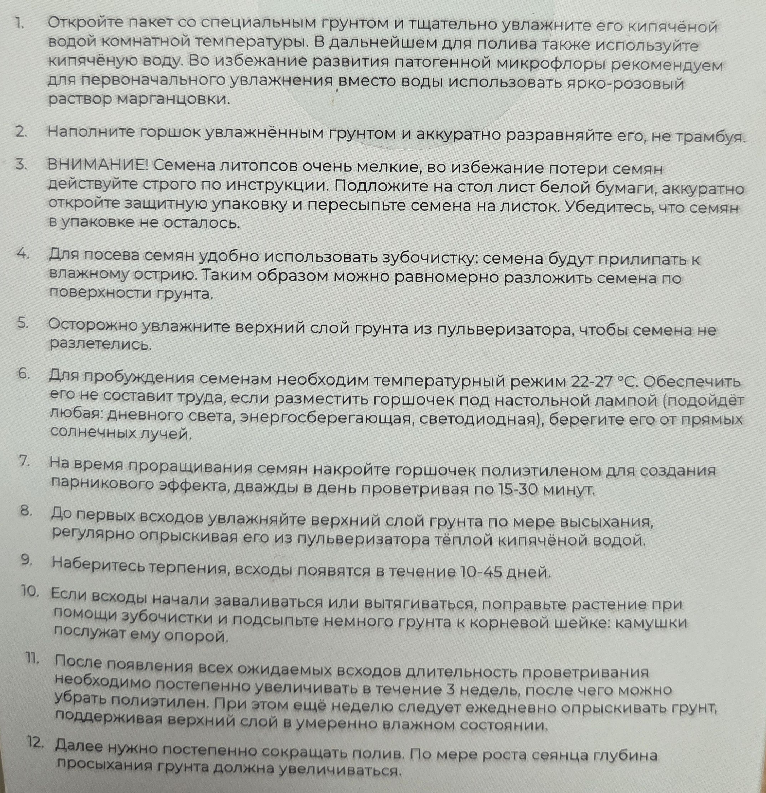
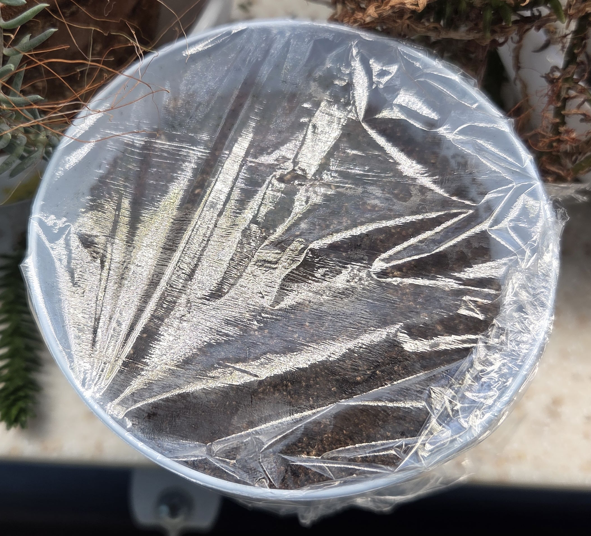
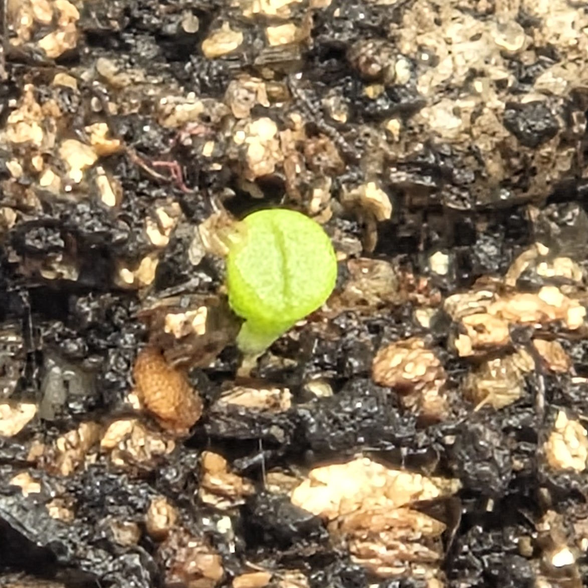
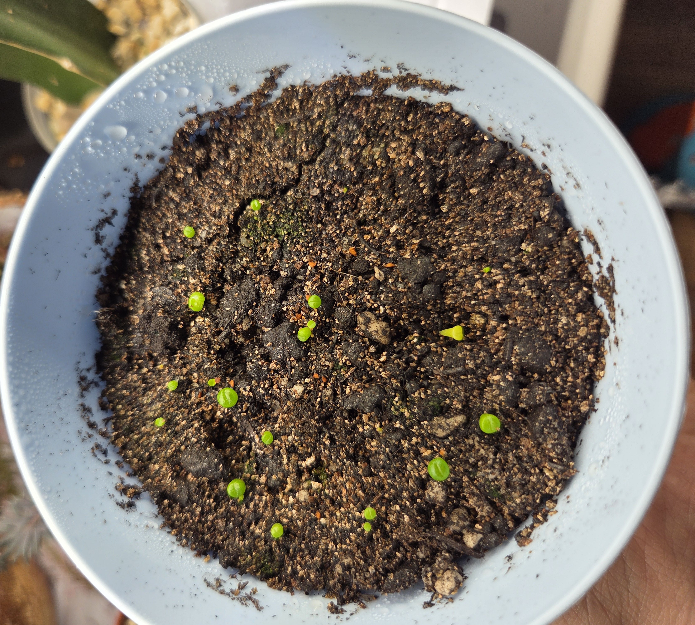
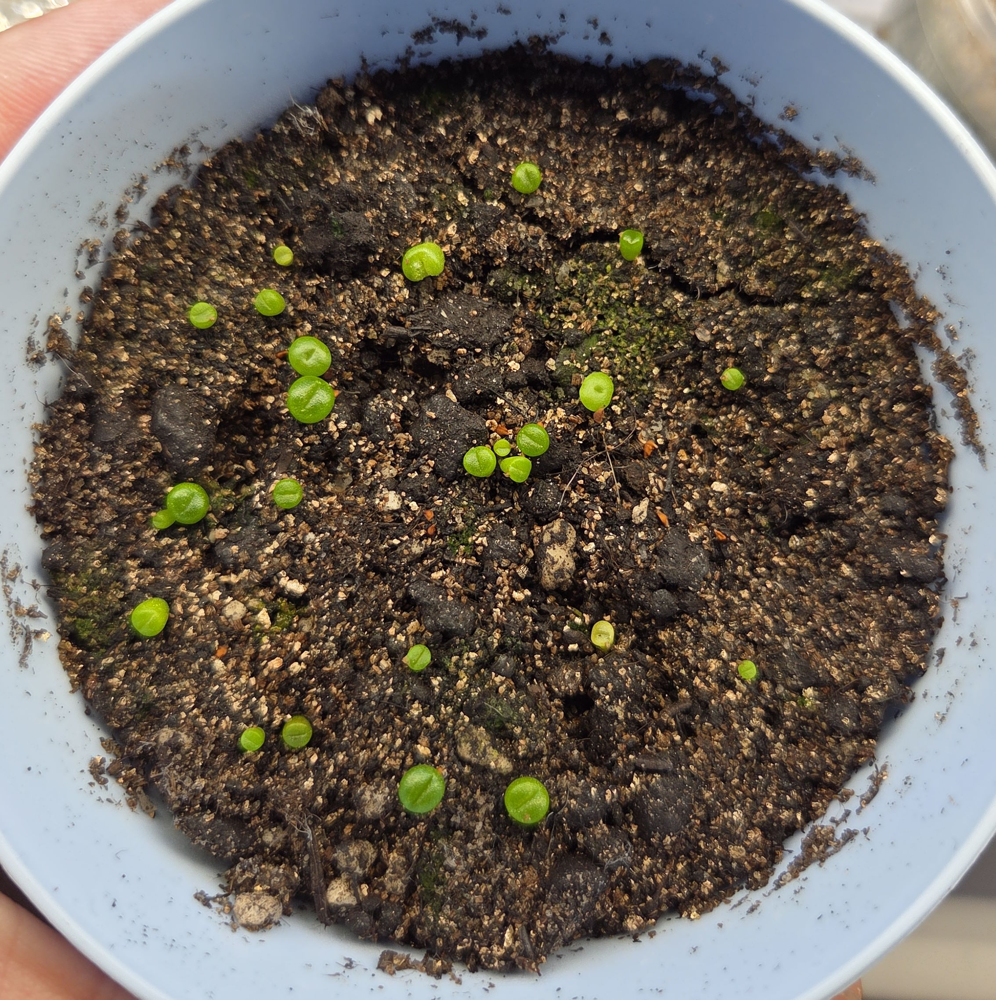

## Фотки

  
2025-08-05 Инструкция по посадке

    

  
2025-08-05 Тепличка

    

## Дневник
2025-08-05 посадил по инструкции  
2025-08-10 взошло 3 шт  
2025-08-11 утром обнаружен 4й  

  
2025-08-11 фотка

    

2025-08-12 утро, все ещё 4 всхода  
2025-08-12 вечер, 5 всходов  
2025-08-13 утро, 5 всходов и еще 1 под вопросом  
2025-08-13 вечер, 6 всходов  
2025-08-14 вечер, 6 всходов  
2025-08-16 утро, 6 всходов  
2025-08-17 вечер, 12 всходов  
2025-08-18 вечер, 13 всходов  
2025-08-19 вечер, 15 всходов  
2025-08-20 вечер, 16 всходов  
2025-08-21 вечер, 17 всходов  
2025-08-22 вечер, 21 всход  

  
2025-08-22 фотка

    

2025-08-23 вечер, 23 всхода  
2025-08-24 днем проветривание 35 минут, вечером проветривание 30 минут, 23 всхода  
2025-08-25 днем проветривание 30 минут, вечером проветривание 30 минут, 24 всхода  
2025-08-26 утром проветривание 30 минут, вечером проветривание 30 минут, 25 всходов  
2025-08-27 утром проветривание больше часа, вечером проветривание 30 минут, 25 всходов  
2025-08-28 утром проветривание 3 часа

  
2025-08-28 фотка

     

2025-08-29 днем проветривание 5 часов  
2025-08-30 днем проветривание 5 часов, политы раствором [Перец Meklon стартовый 7-8-10, EC 0.827](/growing/profiles/pepper-meklon-start.md)  
2025-08-31 днем проветривание 5 часов  
2025-09-01 днем проветривание 5 часов, 30 всходов  