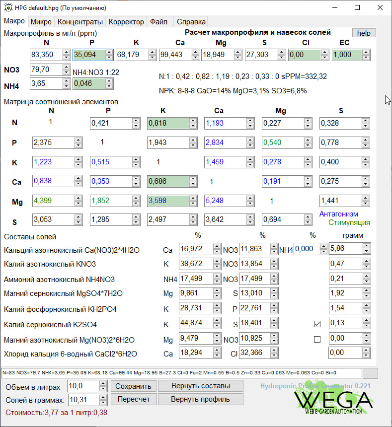
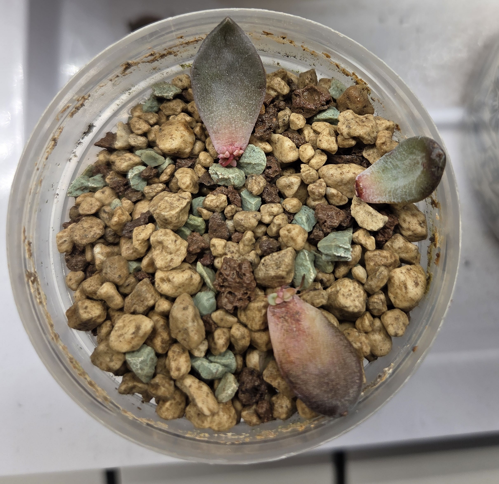
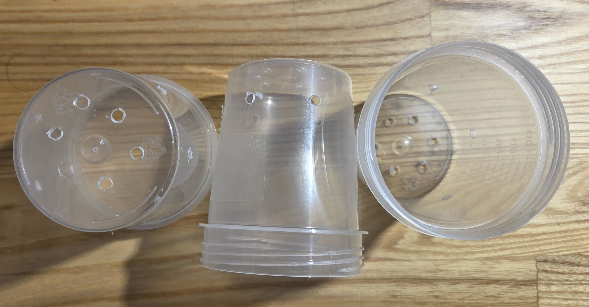
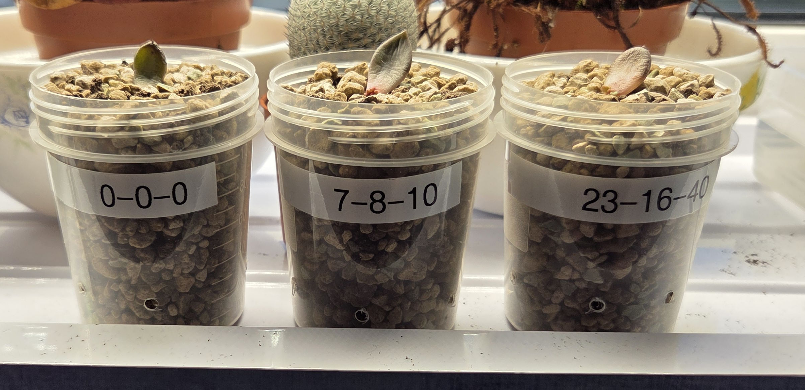
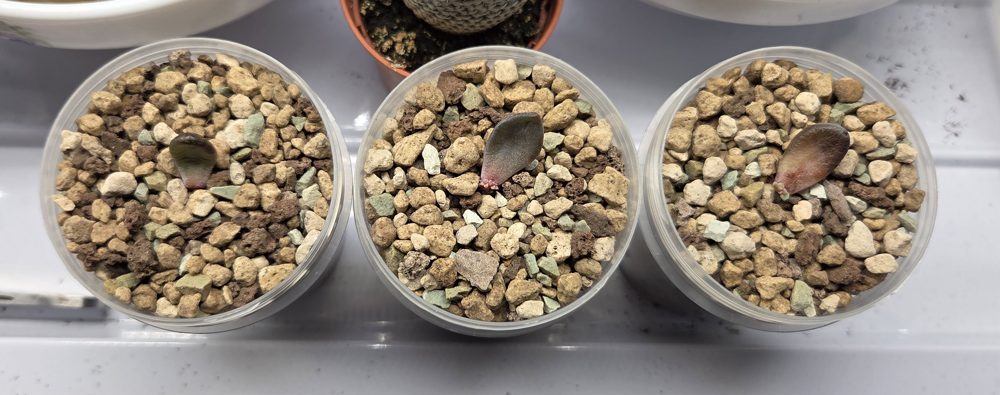

# 2025-08-27 Эксперимент с эчивериями
Я поливаю суккуленты чистым осмосом без реминерализации, жесткостью в среднем 10ppm.  
До сего момента я вообще не удобрял суккуленты, т.е. они годы стояли в грунте с поливом чистым дистиллятом, грунт либо чистая [lechuza pon](/growing/substrat/lechuza-pon.md), либо [lechuza pon / торф](/growing/substrat/lechuza-pon-turf.md)

## Цель экперимента
Выяснить, можно ли сделать раствор который использовать на постоянку для полива вместо чистого осмоса. Подход будет как к гидропонике, потому что чистая лечуза считай и есть субстрат для гидропоники, хотя понятно что суккуленты будут просыхать гораздо дольше.

<!-- truncate -->

## Видео про удобрения
[Георгий](/growing/personalies/aristov.md) : https://www.youtube.com/watch?v=AnDZV_iDY5E  
https://www.youtube.com/watch?v=PgbN9jzgGKc  
краткая выжимка: NPK либо 1:1:1 либо даже азота меньше, PH 8-10.  
NPK мы возьмём по единичке, а пот ph выправлять не будем, но замерим какой получится

## Дизайн эксперимента
2025-08-27 Выбрано три листка, на двух уже есть и корни и розетки, на одном только корешок.  
Посажены в [lechuza pon](/growing/substrat/lechuza-pon.md)  
Листики будут посажены в отдельные горшки, будут поливаться раз в неделю до обильного вытекания раствора из субстрата в поддон. Поддон широкий так что застоя воды происходить не будет.  

### Три профиля
#### 1. Чистый осмос
#### 2. Перец стартовый 7-8-10 с EC 0.827
[стратовый профиль Меклона](docs/growing/profiles/pepper-meklon-start.md)

#### 3. Перец плодоношение NPK 23-16-40, EC 2.348
[профиль плодоношение Меклона](docs/growing/profiles/pepper-meklon-fruiting.md)

#### Отказался идеи от кастомного NPK 8-8-8

    

## Стаканчики
Баночки для анализов ёмкостью 120 ml.  
В баночках сверлом 3.5 мм сделаны отверстия 6 шт в дне и 6 по периметру на расстоянии около 10 мм от дна.  

## 2025-08-28 Эксперимент запущен
Образцы подписаны соответственно 0-0-0, 7-8-10, 23-16-40.  
Пока лечуза той влажности что поставляется в пакете, полив будет осуществляться каждую субботу.  
Поливаться будут:
 * образец 0-0-0 осмосом
 * образец 7-8-10 замесом [2025-08-08 Перец Meklon стартовый 7-8-10, EC 0.827](/growing/mixes/2025-08-08-meklon-start.md)
 * образец 23-16-40 замесом [2025-08-08 Перец Meklon плодоношение NPK 23-16-40, EC 2.348](/growing/mixes/2025-08-08-meklon-fruiting.md)

Образец 0-0-0 самый отстающий, не образовал ещё пока розетки, но другого нет, посмотрим, в целом я уже так выращивал.  

Обсуждение в [lemonwiki](growing/telegrams/lemonwiki.md) [https://t.me/lemonwiki/206568/331808](https://t.me/lemonwiki/206568/331808)
