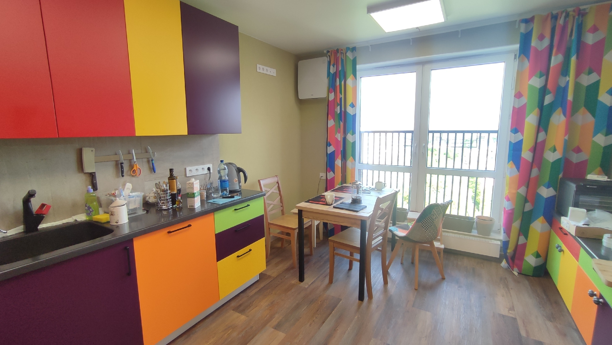
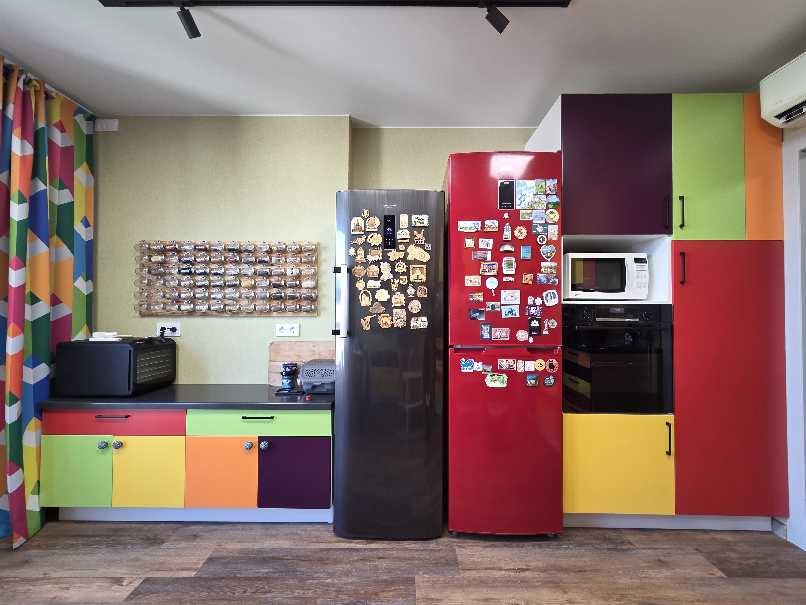
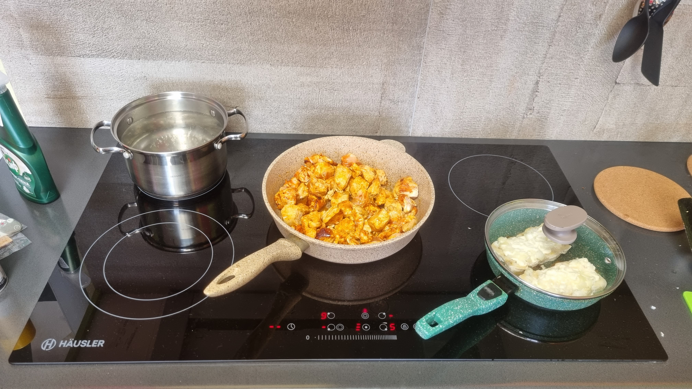

# Фотки кухни

# Радиатор

Радиатор производителя "Изотерм", конвектор Новатерм - стальной. В высоту 16 см, в глубина 10 см, ширина на заказ с шагом 10 см, я выбрал 180 см.
Это дешёвый конвектор, но на удивление прилично выглядит, стоил что-то типа 10 тыс, делали долго, около 3 мес.
Выбрал потому что у него адекватная мощность(1,5 киловата). Т.е. он немного слабее штатного Элегант мини, но незначительно.
