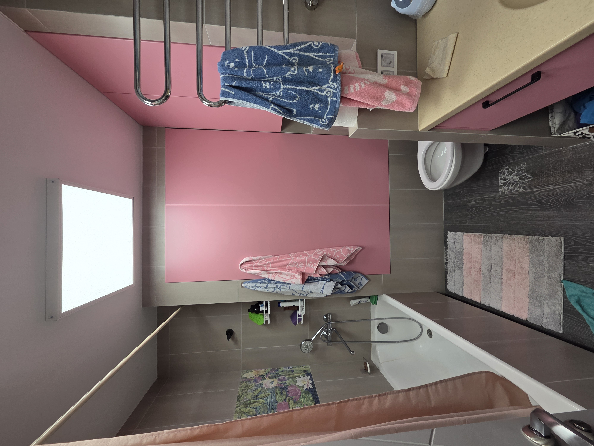
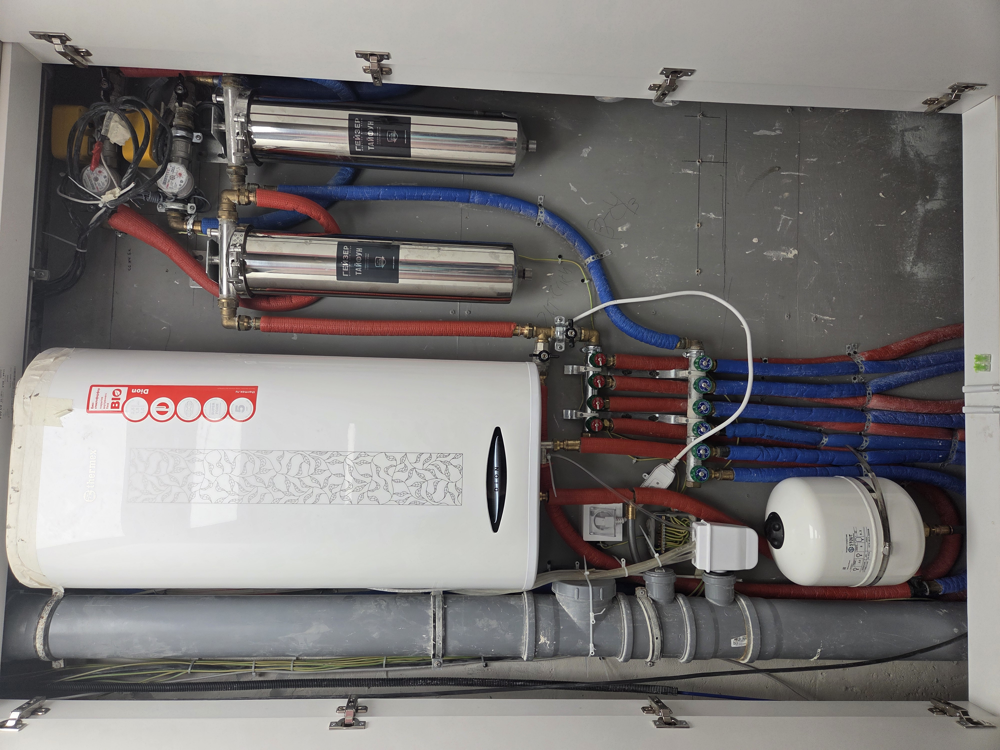
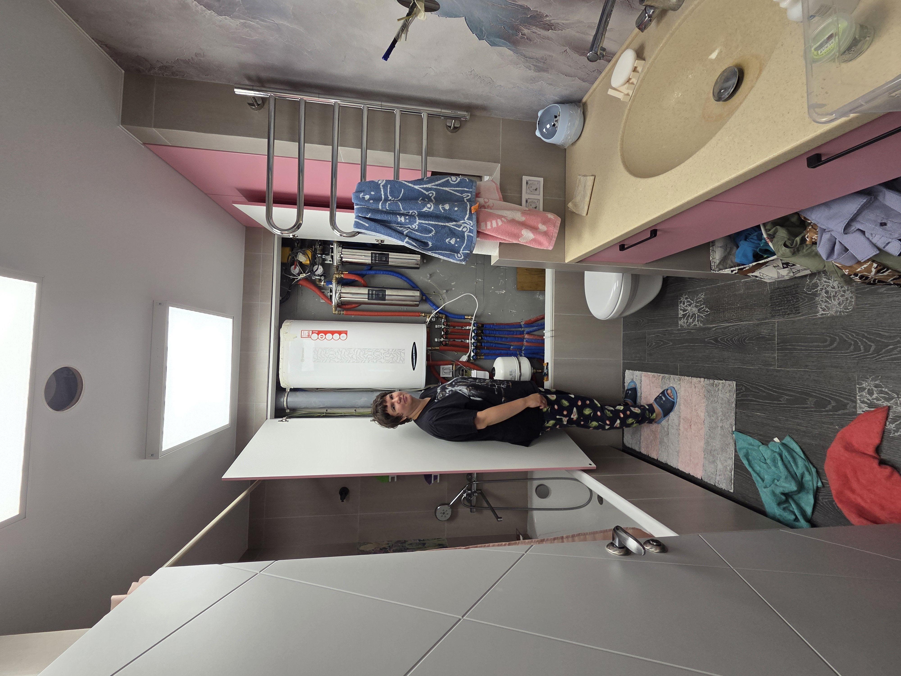
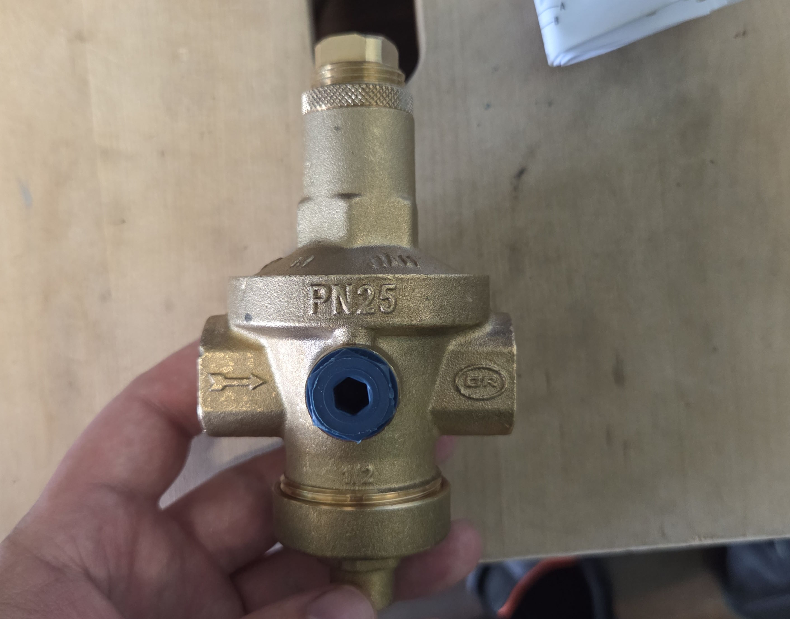

# Водоразборный шкаф
Шкаф большой, чтобы поместился накопительный водонагреватель и компенсатор для него, расчёты ниже. 





# Расчёты водонагревателя
Замер произведён 2024-03-30  
Расход через душ 15 л/м  
температура хол воды на входе 8 градусов, гор 58 градусов  
для душа используется 41 градус  
т.е. греть надо на 33 градуса  
900 кг в час нагреть на 33 градуса  
125 мегаджоулей  
35 киловатт  
Т.е. для того чтобы вообще не заметить переключения на проточный водонагреватель он должен иметь мощность 35 киловатт. Поэтому для комфорта выбран накопительный бак объёмом 50 литов.

# Про расширительный бачок
вход - 8 градусов  
нагрев - 75 градусов  
дельта - 67 градусов  
объём 50 литорв  
коэффициент расширения примем 0.0004 на градус  
```
0.0004*67*50 = 1.34 литра
```
Т.е. вода в бойлере расширится на 1.34 литра. Это абсолютно не страшно если на входе нет обратных клапанов, просто холодная вода будет вытеснена противотоком. Но в моей квартире стоят обратные клапана на входе и этой воде просто некуда деться, в результате расширения, давление, что в холодной, что в горячей воде, поднимется до давления срабатывания аварийного клапана, а это 6-8 атмосфер, что нежелательно. Я применил [
Расширительный бак STOUT STW-0015-000008 для ГВС 8 л. вертикальный ](https://www.stout.ru/catalog/baki-membrannye/baki-dlya-gvs/stout-stw0015000008-stout-rasshiritelnyy-bak-dlya-gvs-8-l-vertikalnyy-tsvet-belyy/)

# 2025-07-14 Редукторы давления
Officine Rigamonti RIO EXPORT 1/2" PN25 от 1 до 7 бар OR.224.G.04 аналог VT.085.N.0407.  
Стало лучше но не то чтобы радикально.


