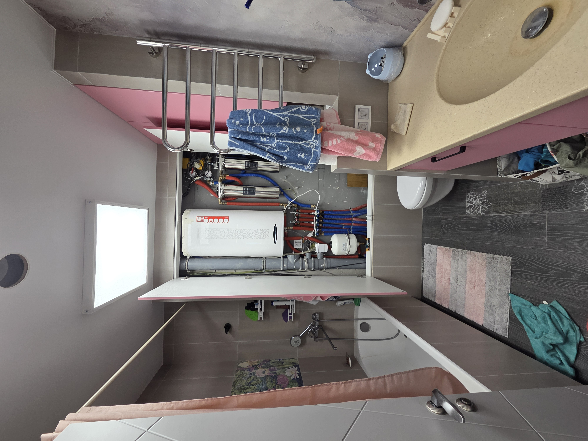
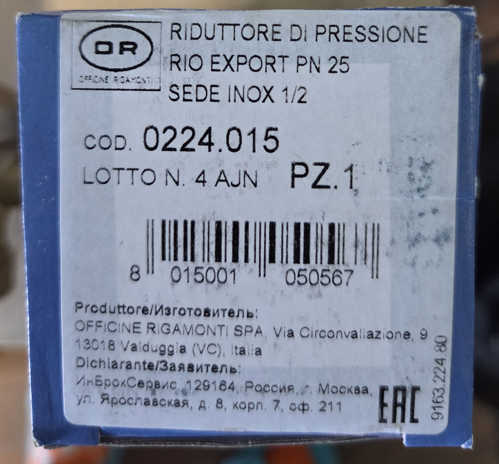
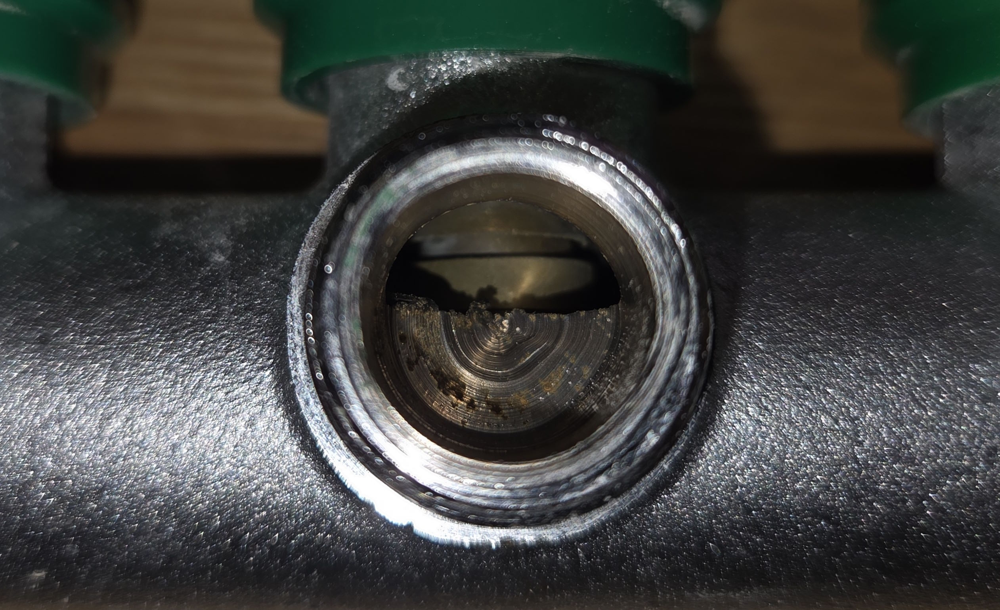

# Водоразборный шкаф
Шкаф большой, чтобы поместился накопительный водонагреватель и компенсатор для него, расчёты ниже. 





# Расчёты водонагревателя
Замер произведён 2024-03-30  
Расход через душ 15 л/м  
температура хол воды на входе 8 градусов, гор 58 градусов  
для душа используется 41 градус  
т.е. греть надо на 33 градуса  
900 кг в час нагреть на 33 градуса  
125 мегаджоулей  
35 киловатт  
Т.е. для того чтобы вообще не заметить переключения на проточный водонагреватель он должен иметь мощность 35 киловатт. Поэтому для комфорта выбран накопительный бак объёмом 50 литов.

# Про расширительный бачок
вход - 8 градусов  
нагрев - 75 градусов  
дельта - 67 градусов  
объём 50 литорв  
коэффициент расширения примем 0.0004 на градус  
```
0.0004*67*50 = 1.34 литра
```
Т.е. вода в бойлере расширится на 1.34 литра. Это абсолютно не страшно если на входе нет обратных клапанов, просто холодная вода будет вытеснена противотоком. Но в моей квартире стоят обратные клапана на входе и этой воде просто некуда деться, в результате расширения, давление, что в холодной, что в горячей воде, поднимется до давления срабатывания аварийного клапана, а это 6-8 атмосфер, что нежелательно. Я применил [
Расширительный бак STOUT STW-0015-000008 для ГВС 8 л. вертикальный ](https://www.stout.ru/catalog/baki-membrannye/baki-dlya-gvs/stout-stw0015000008-stout-rasshiritelnyy-bak-dlya-gvs-8-l-vertikalnyy-tsvet-belyy/)

# Про фильтры
Колбы Гейзер Тайфун, требуют под ними такого же пространства по высоте сколько они сами, потому что фильтр закрпеляется скобой и колбу надо стянуть вниз. Такие колбы выбраны потому что пластиковые иногда отрывает гидроударом, и потому что мне больше нравится такой способ крепления фильтра где лучше контролируется точность установки.

## 2025-06-12 Установка фильтров 
На холодную воду поставил намоточный верёвочный "Гейзер PPY5-20BB" на 5 микрон. Заявленный ресурс 400 кубов
показания счётчика в подъезде холодной воды 576 кубов.

На горячую купил (поставил 2025-06-13) "Нептун PP-20BB 5 мкм" трехслойный нитяной(нетканый), он мне больше понравился. Заявленный ресурс 200 кубов.
показания счётчика в подъезде горячая вода 53.6 куба.

# 2025-07-14 Редукторы давления
Officine Rigamonti RIO EXPORT 1/2" PN25 от 1 до 7 бар OR.224.G.04 аналог VT.085.N.0407.  
Стало лучше но не то чтобы радикально.



# 2025-07-15 Проблема с коллектором
При включении водонегревателя периодически происходили щелчки и горячая вода течь переставала. Как оказалось поддельный коллектор FAR, который поставил мне строитель, при подаче воды через отвод затыкался и работал как обратный клапан. Вот так это проявлялось:
<video controls src="/blog/img/2025-07-15-collector-fail.mp4" title="магия" width="100%"></video>
Вот такая обработка на коллекторе, якобы FAR Made in Italy:

Проблема решена заменой коллектора на Stout из Лемана Про(Леруа Мерлен)