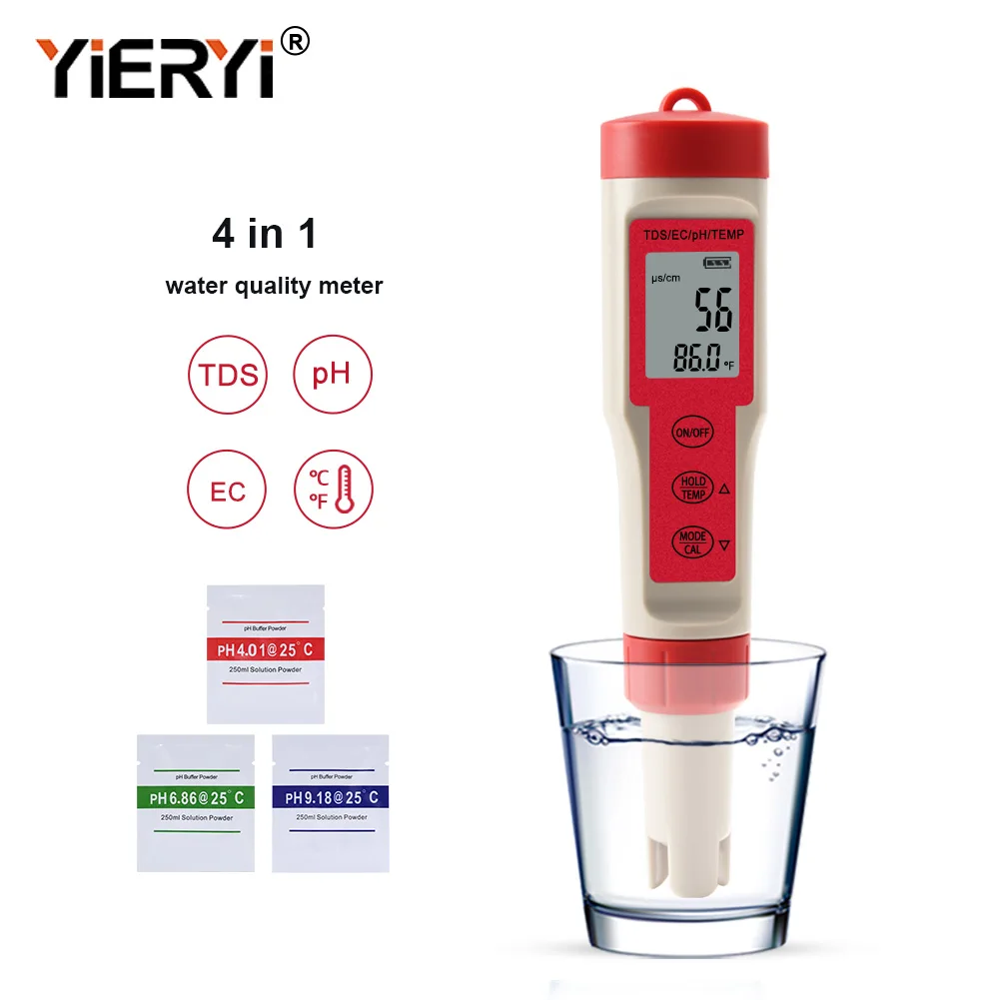
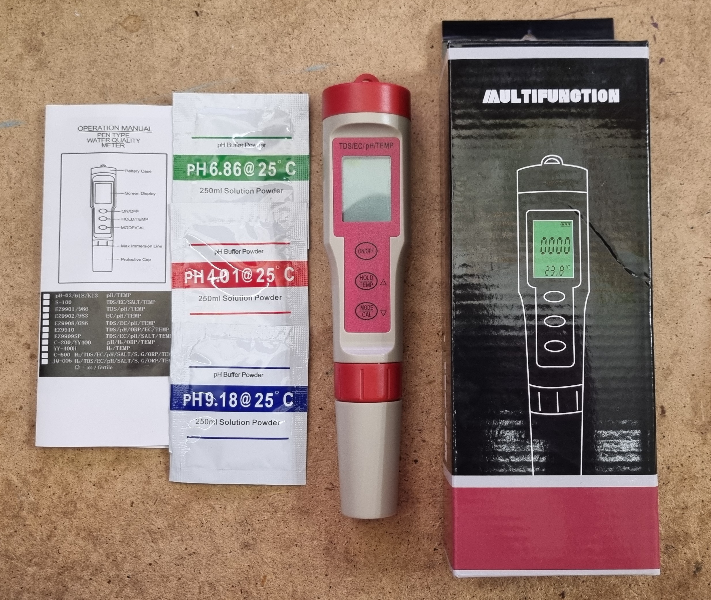
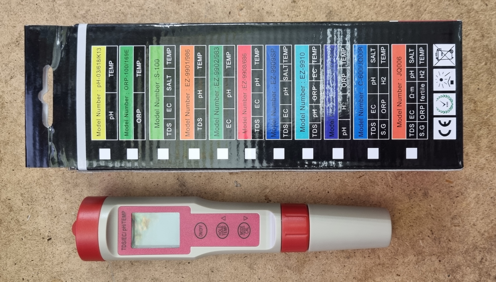
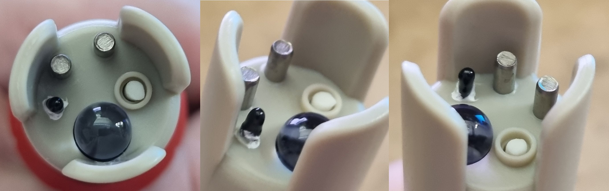
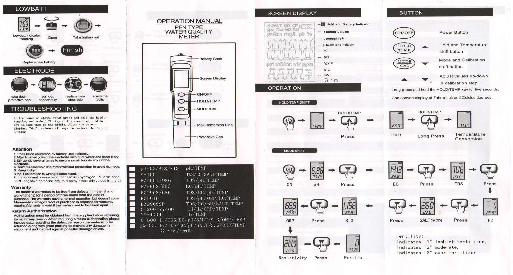
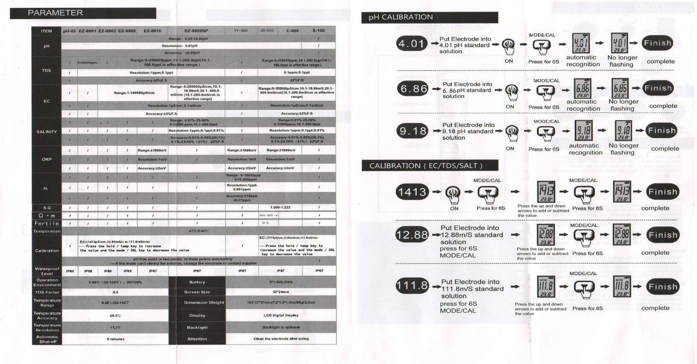
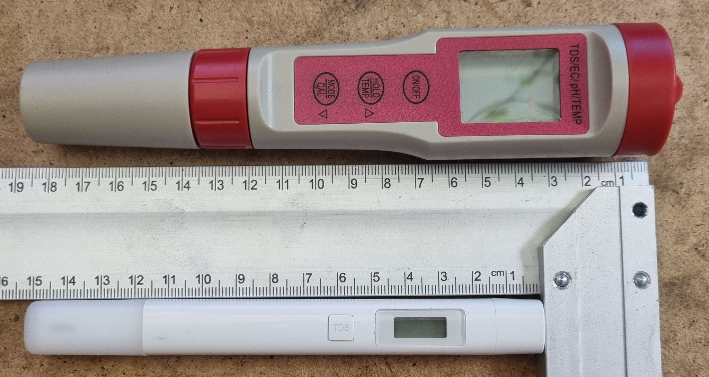
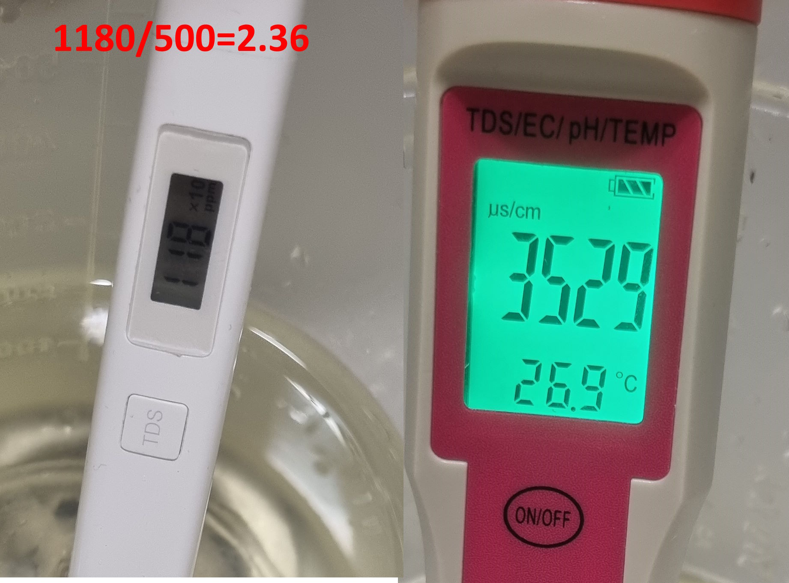

# Электрокондуктометр, EC, PH, TDS EZ-9908/686. Провал калибровки. Сравнение с Xiaomi TDS pen.
В гидропонических кругах широко известен прибор Yieryi EC PH Meter. Я купил что-то на него похожее и оно совсем плохо работает, ниже разбор того как изготовить калибровочные растворы, проверить и попытаться откалибровать прибор. TL;DR: прибор хлам, Xiaomi TDS pen топ.  

  
Как это выглядит на Али

    

Мой же прибор нигде не содержит ни названия производителя ни явно указанной модели, но визуально он точно такой же. Насколько это подделка и что вообще за бренд Yieryi, и будет ли его кто-то подделывать мне не известно. Прибор куплен на Озоне потому что не хотелось ждать.  

  
комплект поставки включает в себя посредственную инструкцию, где не отмечено что за прибор и даже не указан тип батареек (3 шт LR44 подошли)  
  
На упаковке перечислен список моделей с цветами и описаниями, судя по ним у меня EZ-9908/686
  
Как выглядит сенсор  
  
  
Инструкция

В коробке поставляется три пакетика для приготовления растворов разной кислотности и калибровки ph. Для калибровки EC ничего не поставляется. Невозможно поставить порошок для EC т.к. необходимо очень точно рассчитывать объём растворения, об этом ниже.

## Связь TDS (ppm) и EC
Вообще она может быть различной, но для этого прибора, так и для Xiaomi TDS pen использован коэффициент 500. Т.е. для раствора с EC 2.3 Xiaomi TDS покажет 2.3*500=1150 ppm. Т.е. чтобы узнать EC из ppm, нужно просто поделить на 500.  
  
Сравнение с Xiaomi TDS pen  

## Первое впечатление
Xiaomi TDS pen из коробки поставляется весьма хорошо откалиброванным, по эксперименту ошибка менее 0.5%, что весьма неплохо.  
У меня есть раствор с проектным EC 2.3, который при измерении Xiaomi TDS pen показывает те самый 2.3, прибор «из коробки» показал 3.5 (ошибка 34%), после чего я понял что нужно его калибровать.
  
Показания из коробки  

## Калибровка
Для выполнения калибровки, были изготовлены растворы с требуемой в инструкции EC. А именно 1.413, 12.88 и 111.8 мСм/см. Я сделал 0.5г соли на 713г воды, 3.5г соли на 496г воды и 25г соли на 474г воды соответственно.
Уже после написани этого поста вышла подробная статья с тем как делать калибровочные растворы http://raw.githubusercontent.com/Busyrev/NaClSolutions/main/NaClSolutions.pdf

### Проверка растворов
По Xiaomi TDS pen раствор с целевым EC 1.413 мСм/см измерен как 1.42, ошибка менее 0,5%. Раствор целевым EC 12.88 мСм/см измерен как 12.94, ошибка менее 0,5%. Третий раствор измерить Xiaomi TDS pen невозможно, зашкал. В обоих случаях ошибка 0,5%, при том, что растворы замешаны на воде температурой 27 градусов, а не 20 как требуется, по мне великолепный результат.

### Попытка калибровки
Готовим три стакана, куда отливаем калибровочные растворы, и большую ёмкость дистилляты для промывки прибора, чтобы не переносить растворы из одного в другой.

Опускаем прибор в раствор EC 1.413 мСм/см и кнопочками подгоняем значение чтобы на экране тоже было примерно 1413 (на малых значениях прибор переходит с мСм/см на мкСм/см), кликать пришлось долго, думаю не менее 30 кликов. Завершаем калибровку, промываем, ставим в стакан с EC 12.88 мСм/см и наблюдаем цифру 14100 мкСм/см, кликаем минус до совпадения 12.88. Я думал у меня палец отсохнет кликать, я не знаю, сотни кликов. Завершаем калибровку, промываем, ставим в стакан с 111.8 мСм/см видим опять сильно завышенные значения. Делаем под сотню кликов в минус и не видим значимого продвижения. Завершаем калибровку как есть. Промываем и для проверки ставим в первый раствор. 0. Он показывает ноль. В 12.88 слегка занижает (это то что я скликал на более концентрированном растворе)

### Мысли об устройстве прибора
Никакой калибровки по трём точкам нет. Есть тупо один поправочный коэффициент нулевой степени который прибавляется к сырому внутреннему результату тем самым его сдвигая. По хорошему, калибровка по трём точкам должна производиться хотя-бы кусочно-линейно, т.е. с изменением наклона (коэффициент первой степени) и сдвига. Здесь же есть только один сдвиг, которым вы просто физически не можете подогнать три точки. Вы можете только подогнать одну точку по вашему выбору, и в её небольшой окрестности прибор будет работать нормально, если это можно назвать нормальной работой. Получается не то чтобы прибор, а настраиваемый эталон, откалибровали на EC 2 вот и можете проверять что оно примерно 2, при отклонениях врёт.

### Попытка калибровки 2
Откалибровал по первому раствору и измерил два других. 12.88 по мнению этого прибора 14.1 (погрешность 10%) 111.8 по мнению прибора 136.7 (погрешность 22%). И да, вода из осмоса, в которой Xiaomi TDS pen показывает 9 ppm, это чудо показывает 15. Калибровка EC влияет на ppm, т.е. коэффициент один и тот же 500. Вода из-под крана 165 ppm по Xiaomi и 203 по прибору из поста.

### Итог
Как электрокондуктометр EZ-9908/686 мусор, я научился рассчитывать калибровочные растворы и приготавливать их. Убедился в великолепной точности Xiaomi TDS pen на всём диапазоне его работы.

А к гидропонике меня подтолкнул пост: https://habr.com/ru/companies/wiseops/articles/807111/

Комменты на mysku: https://mysku.club/blog/misc/99972.html