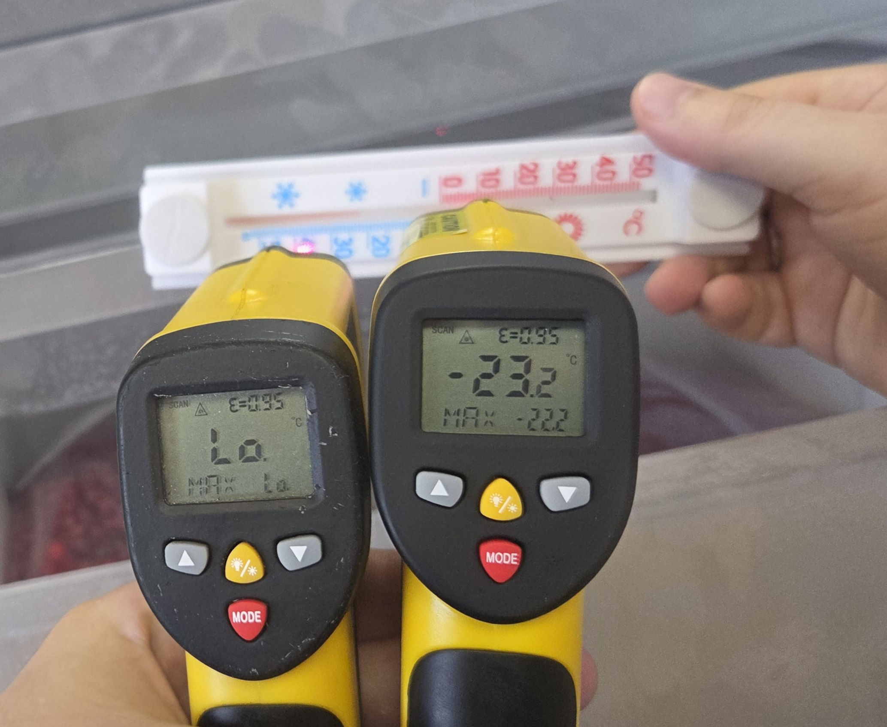
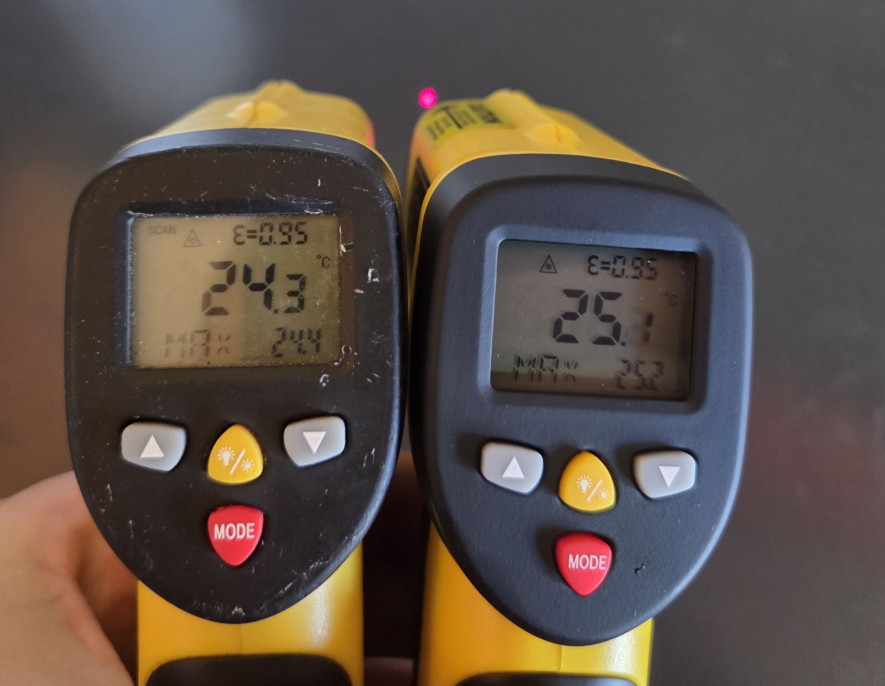
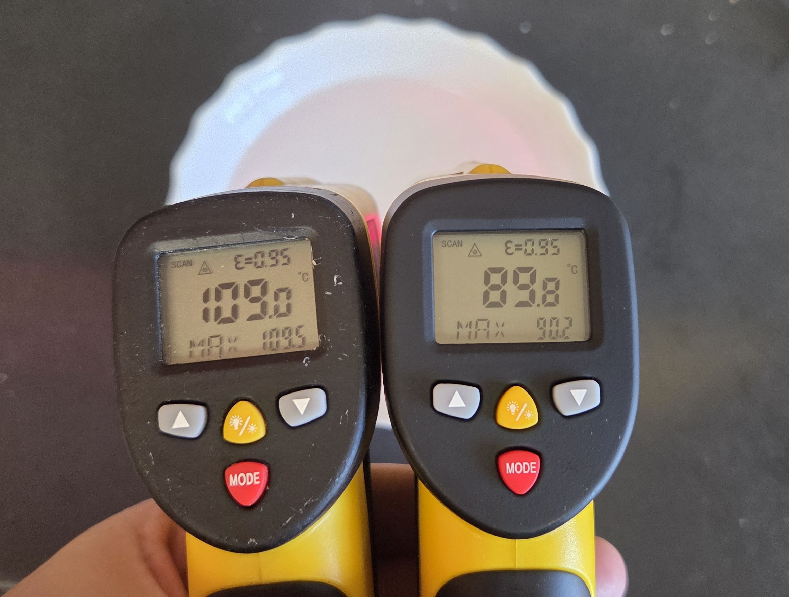
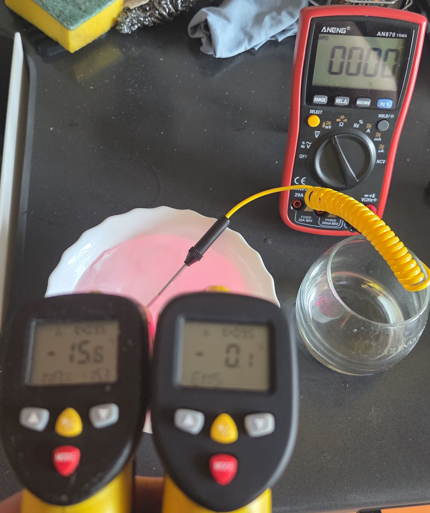

Aliexpress: https://aliexpress.ru/item/1005008666387448.html  
Жил да был у меня пирометр HT-819 уж с 2017 года (куплен за 1729р), очень он мне нравится, да был убит неправильной полярностью батарейки, был заменён на такой же в 2019 году (за 1623р) и вот жил он у меня жил, в основном трудился на кухне, несколько раз в год выезжал на природу и всем я был доволен. Особенно мне нравится его широкий диапазон измерений, двойной лазерный указатель который показывает точку фокуса, и возможность корректировки коэффициента эмиссии, которой я надо сказать, по факту не пользовался. До тех пор как я не купил морозилку. Решил замерить в ней температуру и увидел Lo, что означает ниже предела измерений… Короче я купил ещё один такой-же, уже за 3119 рублей и устроил им испытания:

Здесь и далее неисправный пирометр всегда слева.  
Термометр из морозилки выставленной на -24:  

Пробуем комнатную температуру:  

Да вроде неплохо.  
Попробуем горячую воду:  

Теперь намешаем лёд с водой(надо сказать что только тут я вспомнил что у меня есть мультиметр с термопапой):  

Вот так, совершенно молча измерительный прибор может начать врать, причём так, что диапазон комнатной температуры не повреждён. Возможно я его перегрел измеряя температуру углей возможно ещё что-то. Сказать уплыла ли калибровка плавно или разом после какого-то события не могу. Так что сохраняйте бдительность и перепроверяйте свои измерительные приборы. Если есть ещё предложения по проверке чем-нибудь, пишите, проверим.  

Комменты на mysku: https://mysku.club/blog/misc/104070.html